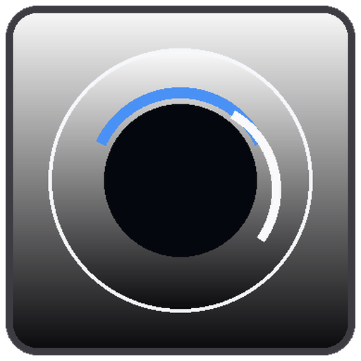
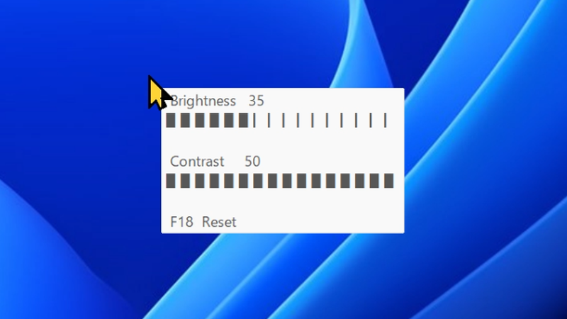
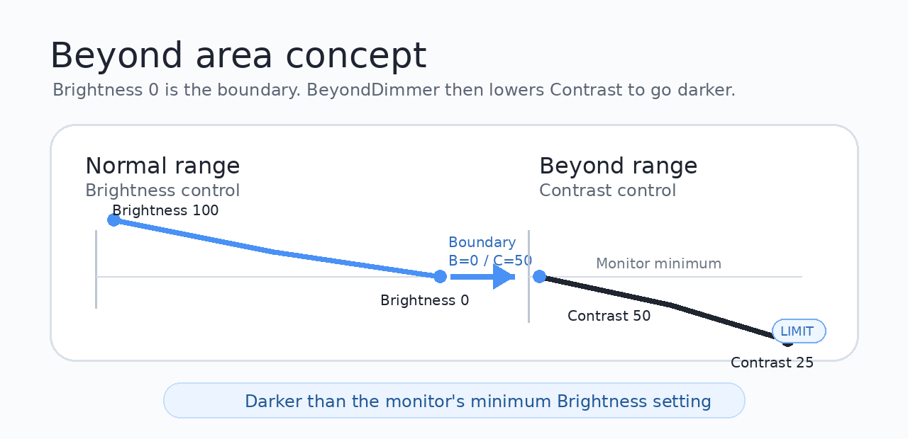

<h1>BeyondDimmer </h1>

> **Make your monitor darker. Work more comfortably.**
>
> BeyondDimmer is a Windows tray utility for quickly adjusting monitor brightness.  
> It goes beyond normal Brightness control by lowering Contrast after Brightness reaches its lower limit, making the screen darker than the monitor's minimum Brightness setting.

<p align="center">
  
</p>

BeyondDimmer is designed for quick brightness control from a left-hand device knob or macro keyboard while you work.

---

## Features

- **Go darker than the monitor's minimum Brightness setting**
- **Real-time equalizer-style ToolTip**
  - Visually displays the current Brightness / Contrast state
  - Automatically disappears after adjustment
  - Responds quickly to key input
  - Controls the monitor directly through DDC/CI using the Windows Monitor Configuration API
- **Optimized for left-hand devices**
  - Works well with a knob or macro keyboard
  - Uses F16 / F17 / F18 as the default keys
- **Keyboard mode**
  - Ctrl + Alt + Up / Down / Home
- Reset operation instantly restores the configured default values
- Runs as a task-tray application
- Reconnect handling after sleep resume, screen unlock, or monitor reconnection
- Flexible configuration through `BeyondDim.ini`
- Multi-monitor support

---

## Demo

### Go beyond the Brightness lower limit

After Brightness reaches 0, BeyondDimmer seamlessly switches to Contrast control and makes the screen even darker.

In this demo, `LIMIT` is displayed when Contrast reaches 25, which is the lower control limit of the tested monitor.

<p align="center">
  
</p>

### Increase Brightness to MAX

BeyondDimmer returns from the Beyond range to normal Brightness control. `MAX` is displayed when Brightness reaches its maximum value.

<p align="center">
  
</p>

> **Note:** This GIF was recorded with screen capture, so the actual brightness and contrast changes are not visible in the GIF. On a real monitor, the screen brightness does change.

---

## How the Beyond range works

BeyondDimmer lowers Contrast after normal Brightness control reaches its lower limit and the display still needs to be darker.

This makes it possible to reduce the visible brightness beyond the monitor's minimum Brightness setting.

<p align="center">
  
</p>

```text
Normal range:
Brightness 100 -> 0

Beyond range:
Brightness stays at 0, then Contrast 50 -> 25
```

---

## Requirements

- Windows 11, tested
- AutoHotkey v2.0, when running from source
- An external monitor that supports DDC/CI Brightness / Contrast control

Built-in display environments, such as notebook PCs or iMac Boot Camp environments, may not support DDC/CI control, or control may be unstable.

If DDC/CI is disabled in the monitor settings, Brightness / Contrast control may not work. Enable DDC/CI from the monitor's OSD menu.

---

## File structure

```text
BeyondDimmer/
├─ src/
│  ├─ BeyondDim.ahk
│  ├─ BeyondDim.ini
│  ├─ Application.ahk
│  ├─ BrightnessController.ahk
│  ├─ Config.ahk
│  ├─ Monitor.ahk
│  ├─ Status.ahk
│  └─ Version.ahk
├─ docs/
│  └─ test.md
├─ assets/
│  ├─ readme/
│  └─ icons/
├─ release/
│  └─ BeyondDim.exe
├─ build.bat
├─ CHANGELOG.md
├─ LICENSE
└─ README.md
```

---

## Starting BeyondDimmer

For the packaged version, run `release/BeyondDim.exe`.

When running from source, run `src/BeyondDim.ahk` with AutoHotkey v2.0.

On first startup, if `BeyondDim.ini` does not exist in the same folder as the script, the default configuration file is created automatically.

---

## Basic controls

The default input mode is `Left-hand_Device`.

| Action | Default key | Description |
|---|---:|---|
| Increase | F16 | Increases Brightness. In the Beyond range, Contrast is restored first |
| Decrease | F17 | Decreases Brightness. After Brightness reaches the lower limit, Contrast is lowered |
| Reset | F18 | Restores Brightness / Contrast to the configured default values |

---

## Configuration file

Settings can be changed in `src/BeyondDim.ini`.

```ini
[Brightness]
Step=5
Default=20
Minimum=0

[Contrast]
Step=5
Default=50
Minimum=0

[Input]
Mode=Left-hand_Device

[Hotkey]
Increase=F16
Decrease=F17
Reset=F18

KeyboardIncrease=^!Up
KeyboardDecrease=^!Down
KeyboardReset=^!Home

[Status]
ShowStatus=1
StatusDuration=800
WarningDuration=1500
```

---

## Input modes

### Left-hand_Device

This mode is intended for left-hand devices and macro keyboards.

```ini
[Input]
Mode=Left-hand_Device
```

Default keys:

```ini
Increase=F16
Decrease=F17
Reset=F18
```

### Keyboard

This mode is intended for normal keyboard operation.

```ini
[Input]
Mode=Keyboard
```

Default keys:

```ini
KeyboardIncrease=^!Up
KeyboardDecrease=^!Down
KeyboardReset=^!Home
```

BeyondDimmer uses AutoHotkey-style modifier notation.

| Symbol | Meaning |
|---|---|
| `^` | Ctrl |
| `!` | Alt |
| `+` | Shift |
| `#` | Windows key |

Example:

```text
^!Home = Ctrl + Alt + Home
```

---

## ToolTip display

When Brightness / Contrast is changed, a ToolTip is displayed near the mouse cursor.

Displayed information:

- Current Brightness value
- Current Contrast value
- Equalizer-style bar display
- MAX / LIMIT indicator
- Reset key display

The ToolTip responds quickly to key input and disappears automatically after adjustment.

The ToolTip can be disabled in `BeyondDim.ini`.

```ini
[Status]
ShowStatus=0
```

The display duration can also be changed.

```ini
StatusDuration=800
WarningDuration=1500
```

The unit is milliseconds.

---

## Sleep resume and monitor reconnection

BeyondDimmer attempts to re-establish monitor control after sleep resume, screen unlock, or monitor reconnection.

If the monitor is temporarily unavailable, BeyondDimmer does not exit with an error and tries to reconnect.

---

## Notes

- BeyondDimmer does not work with monitors that do not support DDC/CI.
- Brightness / Contrast changes may fail while the monitor's OSD menu is open.
- Before regular use, confirm that the Reset key can restore the normal display state.

---

## Development and testing

Pre-release test items are documented in `docs/test.md`.

Main test areas:

- Startup
- Brightness control
- Contrast control
- Reset
- ToolTip display
- INI configuration handling
- Sleep resume
- Monitor reconnection
- UTF-8 without BOM / CRLF

---

## Encoding and line endings

Source files are normalized as follows.

```text
UTF-8 without BOM / CRLF
```

---

## Acknowledgements

- Implementation support: OpenAI ChatGPT
- DDC/CI testing and reference tool: ControlMyMonitor by NirSoft

---

## License

MIT License

See `LICENSE` for details.
